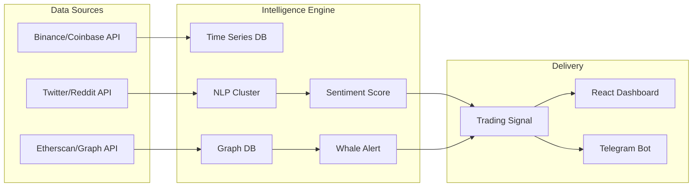

# 🪙 Crypto AI Intelligence Platform

> **Next-generation cryptocurrency analytics engine leveraging Large Language Models (LLMs) for sentiment analysis and Deep Learning for price action forecasting.**

---

## 📋 Executive Summary

The **Crypto AI Intelligence Platform** aggregates multi-modal data sources (blockchain on-chain metrics, social media sentiment, and exchange order books) to provide institutional-grade market insights. 

It moves beyond simple technical analysis by incorporating **Social Volume** and **Developer Activity** metrics to gauge the fundamental health of crypto assets.

### Key Capabilities
- **Sentiment Alpha**: Real-time NLP analysis of Twitter/X and Reddit discussions using BERT/RoBERTa.
- **On-Chain Forensics**: Tracking whale wallet movements and exchange inflows/outflows.
- **Price Prediction**: LSTM-based volatility forecasting models.
- **Automated Reporting**: Daily market intelligence briefs generated by Generative AI.

---

## 🏗️ Technical Architecture

---

## 🚀 Roadmap

This project is in active development.

- [x] Data Ingestion Pipelines (Exchange + Twitter)
- [ ] NLP Sentiment Model Fine-tuning (FinBERT)
- [ ] On-Chain Whale Alert System
- [ ] Public API Release

---

## 👨‍💻 Author

**Soham Barate (Goddex-123)**
*Senior AI Engineer & Data Scientist*

[LinkedIn](https://linkedin.com/in/soham-barate-7429181a9) | [GitHub](https://github.com/goddex-123)
